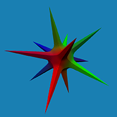
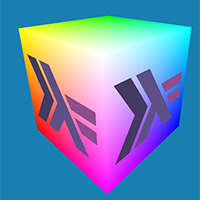
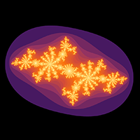
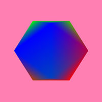

# Examples

* [Installation instructions](#installation)
  - [Windows](#win)
  - [Linux](#linux)
* [Overview of examples](#overview)
  - [Full graphics pipeline](#fullpipeline)
  - [FIR logo](#logo)
  - [Texture sampling](#texture)
  - [Julia set](#julia)
  - [Offscreen rendering](#offscreen)
  - [Bézier curves](#bezier)


<a name="installation"></a>
## Installation instructions

Start off by making sure the [library itself installs properly](../getting_started.md#installation).    

To build the examples, the installation of two external dependencies is necessary: SDL2 (version 2.0.6 or greater), and the Vulkan SDK.
Instructions for building these packages is provided below, for [Windows](#win) and [Linux](#linux).

Once these dependencies are installed, you should be able to run:

```
> cd fir-examples
> cabal build
> cabal run Example
```

where *Example* is any one of the [examples](#overview).

<a name="win"></a>
### Windows

To keep track of external dependencies, we first need to install `pkg-config`.
If this is not already present on your system, download [pkg-config-lite](https://sourceforge.net/projects/pkgconfiglite/)
and add the installed location to your PATH, making `pkg-config` available in the command line.

To install SDL2, download the [SDL2 MinGW development library](https://www.libsdl.org/download-2.0.php) (version 2.0.6 or greater).
After extracting, we need to:
  * Add the `bin` folder to PATH (on 64 bit systems, the folder `SDL2-2.x.y\x86_64-w64-mingw32\bin`).
  * Add the `lib\pkg-config` folder to PKG_CONFIG_PATH to make SDL2 visible to pkg-config.
    If PKG_CONFIG_PATH does not exist (`echo %PKG_CONFIG_PATH%` returns nothing), set it with `setx PKG_CONFIG_PATH path\to\sdl2\lib\pkg-config\`.
You can check that SDL2 is registered with pkg-config using `pkg-config --list-all`.

The Windows Vulkan SDK installer can be downloaded from the [LunarG website](https://vulkan.lunarg.com/sdk/home).
No further setup should be required after installing. The relevant `bin` folder (by default `VulkanSDK\[vulkan-sdk-version]\Bin`) is automatically added to PATH, and the environment variables VULKAN_SDK and VK_SDK_PATH should also have been initialised (pointing to `VulkanSDK\[vulkan-sdk-version]` by default).


<a name="linux"></a>
### Linux
It should be possible to install the SDL2 development kit from your distributions's package repository.

* Ubuntu/Debian: `sudo apt-get install libsdl2-dev`
* ArchLinux: `pacman -S sdl2`

Please ensure that the installed version of SDL2 is at least 2.0.6, as it is this version that adds Vulkan support.
This might require adding newer package repository lists.

For Vulkan, you'll need the Vulkan SDK. What to install will usually depend on your GPU (AMD/NVIDIA/Intel).
The [LunarG website](https://vulkan.lunarg.com/doc/sdk/latest/linux/getting_started.html) provides installation instructions
for the Vulkan SDK on Linux.


<a name="overview"></a>
## Overview of examples

<a name="fullpipeline"></a>
### Full graphics pipeline
<div align="center">

</div>

A graphics pipeline containing all shader stages.

<a name="logo"></a>
### FIR logo
<div align="center">

</div>

Rendering the FIR logo using simple ray tracing in a compute shader.

<a name="texture"></a>
### Texture sampling
<div align="center">

</div>

Demonstrates how to sample a texture.

<a name="julia"></a>
### Julia set
<div align="center">

</div>

Interactive Julia set rendering, computed within a fragment shader.

<a name="offscreen"></a>
### Offscreen rendering
<div align="center">

</div>

Offscreen rendering of a single frame.

<a name="bezier"></a>
### Bézier curves
<div align="center">

</div>

Work in progress: rendering Bézier curves using tessellation and geometry shaders.
Currently computes signed distance to the outline. Still requires a second pass in a compute shader to fill in the outline.
