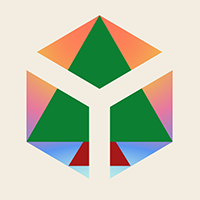

# Examples

* [Installation instructions](#installation)
* [Overview of examples](#overview)
  - [Full graphics pipeline](#fullpipeline)
  - [Compute shader: FIR logo](#compute)
  - [Texture sampling](#texture)
  - [Offscreen rendering](#offscreen)
  - [Bézier curves](#bezier)


<a name="installation"></a>
## Installation instructions
To build the examples, the installation of two external dependencies is necessary: SDL2 and Vulkan.
Once these are installed, one can do:

```
> cd fir-examples
> cabal build
> cabal run Example
```

where *Example* is any one of the [examples](#overview).

<a name="overview"></a>
## Overview of examples

<a name="fullpipeline"></a>
### Full graphics pipeline


A graphics pipeline containing all shader stages.

<a name="compute"></a>
### Compute shader: FIR logo


Rendering the FIR logo using simple ray tracing in a compute shader.

<a name="texture"></a>
### Texture sampling


Demonstrates how to sample a texture.

<a name="offscreen"></a>
### Offscreen rendering


Offscreen rendering of a single frame.

<a name="bezier"></a>
### Bézier curves


Work in progress: rendering Bézier curves using tessellation and geometry shaders.
Currently computes signed distance to the outline. Still requires a second pass in a compute shader to fill in the outline.
