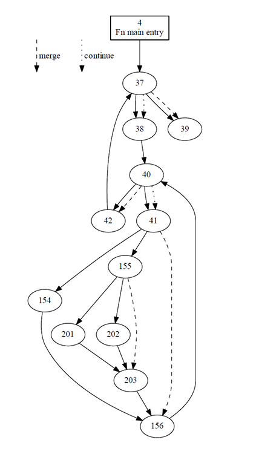

# Getting started with FIR

* [Installation instructions](#installation)
  - [Installing the library](#library)
  - [Installing the documentation](#docs)
  - [Installing the built-in examples](#examples)
* [Writing a simple shader](#simple-shader)
* [Compiling shaders](#compiling)
* [Inspecting the AST](#ast)
* [Controlling inlining](#inlining)
* [Using SPIR-V tools](#spirv)
* [Type-level optics](#optics)
* [Creating a shader pipeline](#pipeline)
* [Manipulating custom data types](#syntactic)

<a name="installation"></a>
## Installation instructions

<a name="library"></a>
### Installing the library

The library itself only has Haskell dependencies, so can easily be installed using a Haskell compiler and package manager:
 * FIR requires [GHC](https://www.haskell.org/ghc/), version 8.8 or greater. See the [GHC downloads page](https://www.haskell.org/ghc/download.html).
 * For the package manager, we'll use [cabal](https://www.haskell.org/cabal/download.html), version 3.0 or greater, but other package managers will work too.

To use FIR in a project, with the GHC and cabal executables added to PATH, we can create a new cabal project using `cabal init`. We then specify a dependency on FIR by adding `fir` to the `build-depends` field of the generated `projectName.cabal` file.
To fetch the project from the GitLab repository rather than Hackage, create the following `cabal.project` file:

```
packages: .

source-repository-package
  type:     git
  location: https://gitlab.com/sheaf/fir.git
  tag:      head
```

Alternatively, download the library (either manually or by running `git clone https://gitlab.com/sheaf/fir.git`) and point to it locally in the `cabal.project` file:

```
packages: .
          path/to/fir
```

After running `cabal update` to fetch the latest Haskell package list, run `cabal build` to build the project.


This completes the required setup; you should now be ready to write shaders and compile them to SPIR-V by importing the library.
A basic example of a shader written using this library is given [below](#simple-shader).
This example [will compile to a SPIR-V file](#compiling), which can then be used in any Vulkan program,
in the same way as if one was writing shaders using GLSL and compiling them with the official `glslangvalidator` front-end.


<a name="docs"></a>
### Installing the documentation

The documentation for the project is available online [here](https://sheaf.gitlab.io/fir/).   
It can, however, be more convenient to build the documentation locally. To do so, we use Haddock.
The `haddock` executable should be in the PATH, as it is bundled with GHC. Start building the documentation by running

```
> cabal haddock --haddock-options="--show-all --hyperlinked-source" --enable-documentation
```

The flag `--show-all` builds the documentation for all modules in FIR, including the internal ones.
The flag `--hyperlinked-source` allows the source code to be browsed through haddock, including hyperlinking identifiers whenever possible.
The flag `--enable-documentation` builds the documentation for all the dependencies.

Upon completion, the documentation can be found in `fir/dist-newstyle/build/{arch}/{ghc-version}/{fir-version}/doc/html/fir/`; start browsing with `index.html`.


<a name="examples"></a>
### Installing the built-in examples

Some [illustrative examples](fir-examples/readme.md) are included, which use the [vulkan](http://hackage.haskell.org/package/vulkan) Haskell bindings.
Refer to the examples page for further information about the examples, including installation instructions.


<a name="simple-shader"></a>
## Writing a simple shader
To write a shader using FIR, create a new module which imports `FIR`.
Additional functionality is provided by the modules `Math.Linear` (vectors and matrices),
`Math.Quaternion` (quaternions) and `FIR.Syntax.Labels` (optional imperative-like syntax using *OverloadedLabels*).

The important types are:
* __`Code a`__: code for a pure value of type `a`, represented internally as an abstract syntax tree.
Type class overloading allows for simple construction of values of this type, e.g. one has:
```haskell
( \ t -> exp ( - tan t ** 2 ) / ( cos t ** 4 ) ) :: Code Float -> Code Float
```
* __`Module defs`__: a program that can be compiled to a SPIR-V module. `defs` is a type-level map which specifies the program inputs/outputs, top-level functions and entry-points; this is the mechanism by which the user specifies shader interfaces and execution modes.
* __`Program i j a`__: an *indexed* monadic expression, starting in state `i` and ending in state `j`. Can be thought of as stateful GPU code producing a value of type `a`. The additional type-level information (the indices) allows the library to enforce program correctness.

Shaders are written using __do__ notation, using this indexed monad (with *RebindableSyntax*).
Stateful operations such as reading/writing data use lens-like syntax, such as:

* `var <- get @"varName"`: get the value of `varName` (within the current monadic context),
* `put @"varName" val`: set the value of `varName` to `val`,
* `var <- def @"varName" @RW val`: define a new readable and writable variable, initialised to `val`, and records its value as `var`. This idiom is useful to preserve sharing, [see below](#inlining).

More general operations such as `use` and `assign` are also available, which take a type-level optic as an (invisible) type-level argument.

To illustrate, consider the following basic vertex shader (required language extensions omitted):

```haskell
import FIR
import Math.Linear

type VertexShaderDefs =
  '[ "ubo"    ':-> Uniform '[ Binding 0, DescriptorSet 0 ]
                      ( Struct '[ "mvp" ':-> M 4 4 Float ] ) -- column-major matrix (Vulkan convention)
   , "in_pos" ':-> Input '[ Location 0 ] (V 4 Float)
   , "main"   ':-> EntryPoint '[] Vertex
   ]

vertexShader :: Module VertexShaderDefs
vertexShader = Module $ entryPoint @"main" @Vertex do
  mvp <- use @(Name "ubo" :.: Name "mvp") -- (:.:) denotes composition of type-level lenses
  in_pos <- get @"in_pos"
  put @"gl_Position" (mvp !*^ in_pos) -- (!*^) means "matrix times vector"
```

The type-level map `VertexShaderDefs` provides the interface for the vertex shader, in this case specifying that it has access to a uniform buffer object `ubo` (consisting of a model-view-projection matrix) and position data (given to the GPU as part of a vertex buffer).
The shader writes to `gl_Position`, which is a variable that is built into vertex shaders with Vulkan.

The application is then responsible for binding the appropriate resources,
in this case a uniform buffer object given binding number 0 and descriptor set index 0.
Memory layout can be automatically computed by the library depending on the usage of the structure, e.g. whether it backs a uniform buffer (extended alignment rules),
a storage buffer or push constants (base alignment rules).
See [FIR.Layout](src/FIR/Layout.hs).

<a name="compiling"></a>
## Compiling shaders

To compile a shader to a file, use the `compileTo` function:
```haskell
compileTo :: FilePath -> [CompilerFlag] -> Module defs -> IO ( Either ShortText ModuleRequirements )
```
To compile the above vertex shader, we can run the function
```haskell
compileVertexShader :: IO ( Either ShortText ModuleRequirements )
compileVertexShader = compileTo "vert.spv" [] vertexShader
```

This produces the following SPIR-V (see the [section on SPIR-V tools](#spirv)):

```
> spirv-dis vert.spv

               OpCapability Shader
               OpCapability Matrix
               OpMemoryModel Logical GLSL450
               OpEntryPoint Vertex %main "main" %gl_Position %in_pos
               OpName %main "main"
               OpName %gl_Position "gl_Position"
               OpName %in_pos "in_pos"
               OpName %ubo "ubo"
               OpName %_ptr_ubo "_ptr_ubo"
               OpMemberName %ubo 0 "mvp"
               OpDecorate %_ptr_ubo Binding 0
               OpDecorate %_ptr_ubo DescriptorSet 0
               OpDecorate %ubo Block
               OpDecorate %in_pos Location 0
               OpDecorate %gl_Position BuiltIn Position
               OpMemberDecorate %ubo 0 ColMajor
               OpMemberDecorate %ubo 0 MatrixStride 16
               OpMemberDecorate %ubo 0 Offset 0
       %void = OpTypeVoid
          %2 = OpTypeFunction %void
      %float = OpTypeFloat 32
    %v4float = OpTypeVector %float 4
%mat4v4float = OpTypeMatrix %v4float 4
        %ubo = OpTypeStruct %mat4v4float
%_ptr_Uniform_ubo = OpTypePointer Uniform %ubo
       %uint = OpTypeInt 32 0
     %uint_0 = OpConstant %uint 0
%_ptr_Uniform_mat4v4float = OpTypePointer Uniform %mat4v4float
%_ptr_Input_v4float = OpTypePointer Input %v4float
%_ptr_Output_v4float = OpTypePointer Output %v4float
%gl_Position = OpVariable %_ptr_Output_v4float Output
     %in_pos = OpVariable %_ptr_Input_v4float Input
   %_ptr_ubo = OpVariable %_ptr_Uniform_ubo Uniform
       %main = OpFunction %void None %2
          %4 = OpLabel
         %14 = OpInBoundsAccessChain %_ptr_Uniform_mat4v4float %_ptr_ubo %uint_0
         %15 = OpLoad %mat4v4float %14
         %18 = OpLoad %v4float %in_pos
         %19 = OpMatrixTimesVector %v4float %15 %18
               OpStore %gl_Position %19
               OpReturn
               OpFunctionEnd
```

Sometimes it is more convenient to have the shaders be compiled when we compile our graphics application, as opposed to when we run it. To that end, a simple Template Haskell function is also provided:
```haskell
runCompilationsTH :: [ ( ShortText, IO (Either ShortText ModuleRequirements) ) ] -> Q Exp
```
To compile the above Vertex shader to disk at compile-time, it suffices to perform a TH splice:
```haskell
shaderCompilationResult :: Either ShortText ModuleRequirements
shaderCompilationResult
  = $( runCompilationsTH
        [ ("Simple vertex shader", compileVertexShader) ]
     )
```

Note that it is also possible to directly obtain a SPIR-V binary by using the `compile` function:
```haskell
compile :: [CompilerFlag] -> Module defs -> IO ( Either ShortText ( Maybe ModuleBinary, ModuleRequirements ) )
```
Such binaries can be passed directly to Vulkan without needing any disk read/write operations.

<a name="ast"></a>
## Inspecting the AST

It is possible to view the AST that this library generates,
using the `showAST` and `drawAST` commands. For instance:

```
> drawAST vertexShader

Bind
 ├╴Entry @Vertex
 │  └╴Bind
 │     ├╴Use @(Binding "ubo" :.: Index 0)
 │     └╴Lam %2
 │        └╴Bind
 │           ├╴Use @(Binding "in_pos")
 │           └╴Lam %3
 │              └╴Bind
 │                 ├╴Assign @(Binding "gl_Position")
 │                 │  └╴PrimOp MatrixTimesVector
 │                 │     ├╴%2
 │                 │     └╴%3
 │                 └╴Lam %4
 │                    └╴Return
 │                       └╴%4
 └╴Lam %1
    └╴Return
       └╴%1
```

The AST pretty-printing is performed using the [tree-view](http://hackage.haskell.org/package/tree-view) package.

If you get an error when attempting to pretty-print an AST, such as:

> *** Exception: <stdout>: hPutChar: invalid argument (invalid character)

it might be necessary to set your console to support UTF-8 output.
On Windows, this can be achieved with the command `chcp.com 65001`.

<a name="inlining"></a>
## Controlling inlining

When working with this library, one needs to be careful with inlining. Consider the following example:

```haskell
inlined :: Code Float -> Code (V 3 Float)
inlined t
  let u = cos ( 2 * pi * t )
  in  Vec3 u u u
```
As `let x = a in e` desugars to `(\x -> e) a`, `u` is inlined, which results in a loss of sharing:
```
%1 = OpFMul %float %float_2 %float_pi
%2 = OpFMul %float %1 %t
%3 = OpExtInst %float %GLSL Cos %2
%4 = OpFMul %float %float_2 %float_pi
%5 = OpFMul %float %4 %t
%6 = OpExtInst %float %GLSL Cos %5
%7 = OpFMul %float %float_2 %float_pi
%8 = OpFMul %float %7 %t
%9 = OpExtInst %float %GLSL Cos %8
%r = OpCompositeConstruct %v3float %3 %6 %9
```

This effect can compound rapidly with successive inlinings, so it is best to be careful.
To circumvent this problem, we define variables that record the result of intermediate computations, as follows:

```haskell
shared :: Code Float -> Program _i _j (Code (V 3 Float))
shared t = do
  u <- def @"u" @R $ cos ( 2 * pi * t )
  pure (Vec3 u u u)
```
Usage of this function compiles to the appropriate SPIR-V code:
```
%1 = OpFMul %float %float_2 %float_pi
%2 = OpFMul %float %1 %t
%3 = OpExtInst %float %GLSL Cos %2
%r = OpCompositeConstruct %v3float %3 %3 %3
 ```


<a name="spirv"></a>
## Using SPIR-V tools

Khronos provides many useful tools to deal with SPIR-V, which are included in the Vulkan SDK.  
See the [examples readme](fir-examples/readme.md#installation) for instructions concerning installation of the Vulkan SDK.

Example usage of SPIR-V tools:

* spirv-val: validate a SPIR-V file:
  - `spirv-val sourceProg.spv` to validate.
* spirv-dis: display the SPIR-V instructions in human-readable format:
  - `spirv-dis sourceProg.spv` to view,
  - `spirv-dis sourceProg.spv -o sourceProg.spv-asm` to create an editable disassembly.
* spirv-as: re-assemble SPIR-V disassembly:
  - `spirv-as dissassembly.spv-asm -o reassembled.spv`.
* spirv-opt: optimise a SPIR-V file:
  - `spirv-opt sourceProg.spv -O -o sourceProg_opt.spv` to optimise for performance,
  - `spirv-opt sourceProg.spv -Os -o sourceProg_opt.spv` to optimise size of SPIR-V binary.
* spirv-cross: cross-compile a SPIR-V file to another shading language (GLSL/HLSL/Metal).
* spirv-cfg: create a control flow graph, output as a DOT graph:
  - `spirv-cfg sourceProv.spv -o sourceProgCFG.dot` to create the DOT graph,
  - `dot -Tpdf sourceProgCFG.dot -o sourceProgCFG.pdf` to render the graph into a PDF (requires GraphViz `dot` executable).

<div align="center">

</div>


<a name="optics"></a>
## Type-level optics

### Defining optics

This library provides optics and optic combinators at the type-level.    

* Basic building blocks:
  - `Index (i :: Nat)`, a lens focusing on a given index (e.g. first index of a vector). Numbering starts at 0. When indexing a matrix, indexes first by columns, not rows (column-major representation).
  - `Name (f :: Symbol)`, a lens focusing on a field with given name (within a structure for example).
  - `AnIndex (ty :: Type)`, a lens focusing on a given index, except that the index is provided at runtime, e.g. `AnIndex Word32` corresponds to an index of type `Word32` passed at runtime.
  Numbering starts at 0.
  Note that only arrays and vectors can use runtime indices, structures and matrices cannot.
  - `OfType (ty :: Type)`, a setter focusing on all fields of the given type, at once.
* Combinators:
  - `optic_1 :.: optic_2`, the composite of `optic_1` and `optic_2`. Composition is done left-to-right, as usual in optics libraries (but opposite to function composition with `(.)`).
  - `Prod (optic_1 :*: ... :*: optic_n :*: EndProd)`, a product optic, which combines optics "side-by-side".
  Note that these products are necessarily lawful, as the library enforces disjointness with type-level checks.

The kind of an optic contains three pieces of information:

```haskell
optic :: Optic is s a
```

* `is` is a list of types, consisting of the indexing information this type-level optic
will need to be provided with at runtime (via extra arguments).
* `s` is the type of the ambient object the optic relates to (the "whole"),
* `a` is the type of the component being focused onto (the "part").

Some examples of type-level optics, and their kinds:

```haskell
-- focus on the first component of a vector
Index 0 :: Optic '[] (V 3 Float) Float

-- composition: first access field named "y",
-- then inside that the second component of the vector
( Name "y" :.: Index 1 ) :: Optic '[] (Struct '[ "x" :-> Float, "y" :-> V 2 Double ]) Double

-- runtime indexing into an array, with an index of type Word32
AnIndex Word32 :: Optic '[Word32] (Array 16 Double) Double

-- focus onto all floats within an object (can be used to set values simultaneously)
OfType Float :: Optic '[] (Struct '[ "r" :-> Float, "q" :-> V 3 Float ]) Float

-- focus onto the diagonal of a 2x2 matrix
Prod ( ( Index 0 :.: Index 0 ) :*: ( Index 1 :.: Index 1 ) :*: EndProd )
  :: Optic '[] (M 2 2 Float) (V 2 Float)
```

### Using optics

Operations using these optics mirror the [lens library](http://hackage.haskell.org/package/lens), except that optics have to be specified at the type-level via type applications. This includes:

  * pure operations such as `view @getter s`, `set @setter a s`, `over @lens f s`,
  * stateful operations such as `use @getter`, `assign @setter a`, `modifying @lens f`.

For instance:

```haskell
vec :: V 4 Float
vec = V4 0 1 2 3

> view @(Index 2) vec
2

mat :: M 2 2 Float
mat = M22
  0 1
  2 3

-- set all components of type "Float" within second column (index = 1) to the value '7'
> set @( Index 1 :.: OfType Float ) 7 mat
M22
  0 7
  2 7
```

When an optic uses runtime indices, these have to be specified first as extra arguments:

```haskell
nestedArray :: Array 16 (Array 16 Float)

> view @(AnIndex Word32 :.: AnIndex Word32) i1 i2 nestedArray
-- returns: ( nestedArray ! i1 ) ! i2
```

Recall that the number of arguments can be read off from the type. In this example, we had:

```haskell
( AnIndex Word32 :.: AnIndex Word32 ) :: Optic '[ Word32, Word32 ] ( Array 16 (Array 16 Float) ) Float
```

### Other useful optics

Some other useful optics, which can be defined with the basic building blocks and combinators described above, are also supplied by this library:

  * `Col (i :: Nat)` and `Row (i :: Nat)`: lenses focusing on a column/row of a matrix (useful to avoid having to remember that `Index i` accesses a column of a matrix, not a row).
  * `Cols` and `Rows`: setters focusing on all columns/rows of a matrix at once.
  * `Entry (i :: Nat) (j :: Nat)`: lens focusing on the entry in the i-th row, j-th column of a matrix.
  * `Diag`: lens focusing on the diagonal of a matrix.
  * `Center`: setter focusing on the center of a matrix (setting all diagonal elements to the same value).
  * `Elts`: setter focusing on all the components of a vector/matrix/array at once.
  * `ImageTexel (imgName :: Symbol)`. Lens focusing on an image texel, to be used with `use`/`assign`.
  Expects two runtime arguments: the image operands to use, and the texel coordinate.    
  That is, valid usage is of the following form:
    - `assign @(ImageTexel "myImage") imageOperands texelCoord value`,
    - `use @(ImageTexel "myImage") imageOperands texelCoord`.


<a name="pipeline"></a>
## Creating a shader pipeline

Graphics shaders, such as vertex or fragment shaders, cannot be used on their own.
Instead, they must be combined into a graphics pipeline, where the output of one shader becomes the input for the next.

Consider for example the following simple pipeline, consisting of a vertex shader fed into a fragment shader:

```haskell
type VertexData =
  '[ Slot 0 0 ':-> V 3 Float -- a 3-vector specifying position, located in slot 0, component 0
   , Slot 1 0 ':-> V 4 Float -- a 4-vector specifying colour  , located in slot 1, component 0
   ]

type VertexDefs =
  '[ "in_position" ':-> Input  '[ Location 0 ] (V 3 Float)
   , "in_colour"   ':-> Input  '[ Location 1 ] (V 4 Float)
   , "out_colour"  ':-> Output '[ Location 0 ] (V 4 Float)
   , "ubo"         ':-> Uniform '[ Binding 0, DescriptorSet 0 ]
                          ( Struct '[ "mvp" ':-> M 4 4 Float ] )
   , "main"        ':-> EntryPoint '[] Vertex
   ]
vertex :: ShaderModule "main" VertexShader VertexDefs _
vertex = shader do
  ~(Vec3 x y z) <- get @"in_position"
  mvp <- use @(Name "ubo" :.: Name "mvp")
  put @"gl_Position" ( mvp !*^ Vec4 x y z 1 )
  put @"out_colour"  =<< get @"in_colour"

type FragmentDefs =
  '[ "in_colour"  ':-> Input      '[ Location 0 ] (V 4 Float)
   , "out_colour" ':-> Output     '[ Location 0 ] (V 4 Float)
   , "main"       ':-> EntryPoint '[ OriginUpperLeft ] Fragment
   ]
fragment :: ShaderModule "main" FragmentShader FragmentDefs _
fragment = shader do
  put @"out_colour" =<< get @"in_colour"


shaderPipeline :: ShaderPipeline
shaderPipeline
  = ShaderPipeline
  $    StructInput @VertexData @(Triangle List)
  :>-> (vertex  , "shaders/vert.spv")
  :>-> (fragment, "shaders/frag.spv")
```

Here, we specify a snoc-list `vertexInput :>-> shader_1 :>-> ... :>-> shader_n`,
which contains the following information:

  * The type of the input to the pipeline. This consists of:

    - The primitive topology used for vertex input assembly. In this case, the topology is `Triangle List`, meaning that we are specifying a list of vertices, with consecutive chunks of three vertices forming a triangle.
    The primitive topology is supplied with type-level data of kind [FIR.Pipeline.PrimitiveTopology Nat](src/FIR/Pipeline.hs), such as `Points`, `Triangle Fan` or `PatchesOfSize 9`.

    - The type of the data attached to each vertex. In this case we are attaching a structure to each vertex, of type `Struct VertexData`. When it comes to performing a draw call using this pipeline, the Vulkan application will use a vertex buffer, which will need to have been appropriately populated with position and colour data for each vertex in the buffer.
    
    Note that we have to specify layout information using location and component slots, as explained in [FIR.Validation.Layout](src/FIR/Validation/Layout.hs).
    
    See also the [shaders from the Hopf fibration example](fir-examples/examples/shaders/FIR/Examples/Hopf/Shaders.hs), which illustrate the usage of this layout information.

  * The shaders which make up the pipeline, with their associated filepaths.


This library will then validate the pipeline at the type-level (i.e. at compile-time) to ensure that:

  * the pipeline sequence is correct (e.g. vertex shader preceding fragment shader),
  * the primitive topology is compatible with the shaders (e.g. in the presence of tessellation shaders, the primitive topology __must__ be `PatchesOfSize (n :: Nat)`),
  * the shader interfaces match (including layout information and decorations).

This is useful as it catches mistakes in shaders and shader interfaces (including some that the official Vulkan validator doesn't catch).
Much better to get a compile-time type error that a black screen at runtime!


Convenience functionality to create Vulkan graphics pipelines from such information is also provided, using the [vulkan](http://hackage.haskell.org/package/vulkan) Haskell bindings (see [`Vulkan.Pipeline.createGraphicsPipeline`](fir-examples/src/Vulkan/Pipeline.hs)).

<a name="syntactic"></a>
## Manipulating custom data types

To allow user-defined types to be internalised and compiled to *SPIR-V*, one needs to implement an instance of the `Syntactic` typeclass:

```haskell
class Syntactic a where
  type Internal a :: AugType
  toAST :: a -> AST (Internal a)
  fromAST :: AST (Internal a) -> a
```

Here `AugType` is the kind of types used internally. Such an augmented type is either:
  
  * a value `Val ty` for some type `ty`,
  * a partially applied function symbol `ty1 :--> ty2` for some augmented types `ty1`, `ty2`,
  * an effectful computation `Eff i j ty`.

Note also the definition `Code a = AST (Val a)`.

Some helpers are provided for types which are known to internalise to values:

```haskell
type family UnderlyingType ( t :: AugType ) :: Type where
  UnderlyingType (Val ty) = ty
  UnderlyingType (Eff i j a) = (a := j) i -- McBride's AtKey representation of stateful computations
  UnderlyingType (s :--> t) = UnderlyingType s -> UnderlyingType t

type InternalType a = UnderlyingType (Internal a)
type family SyntacticVal a :: Constraint where
  SyntacticVal a = ( Syntactic a, Internal a ~ Val (InternalType a) )
```

With this information in hand, here's how to internalise a simple product type:

```haskell
data AB a b = AB (Code a) b

instance ( PrimTy a, SyntacticVal b, PrimTy (InternalType b) )
       => Syntactic (AB a b) where
  type Internal (AB a b) = Val ( Struct '[ "a" ':-> a, "b" ':-> InternalType b ] )
  toAST (AB a b) = Struct ( a :& toAST b :& End )
  fromAST struct = AB ( view @(Field "a") struct ) ( fromAST ( view @(Field "b") struct ) )
```

This will then allow the library to handle values of type `AB a b`, by converting them under the hood to the associated internal type (a structure).

For sum types, it can be slightly more difficult, as the tag has to be an internal value instead of a Haskell-level constant. For instance, here's how this library defines its own option type:

```haskell
data Option a = Option { isSome :: Code Bool, fromSome :: a }

instance ( SyntacticVal a, PrimTy (InternalType a) ) => Syntactic (Option a) where
  type Internal (Option a) =
    Val (Struct '[ "isSome" ':-> Bool, "fromSome" ':-> InternalType a ])
  toAST (Option { isSome = c, fromSome = a })
    = if c
      then ( Struct ( Lit True  :& toAST a   :& End ) )
      else ( Struct ( Lit False :& Undefined :& End ) )
  fromAST struct
    = Option
      { isSome   =          view @(Name "isSome"  ) struct
      , fromSome = fromAST (view @(Name "fromSome") struct)
      }
```

Note that the Boolean discriminator needs to be internal, as the whole point of such a datatype is that we don't know at compile-time whether the option type holds a value or not.
