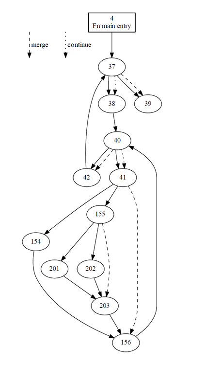

# Getting started with FIR

* [Installation instructions](#installation)
* [Writing a simple shader](#simple-shader)
* [Compiling shaders](#compiling)
* [Inspecting the AST](#ast)
* [Controlling inlining](#inlining)
* [Using SPIR-V tools](#spirv)

<a name="installation"></a>
## Installation instructions

__Requirements:__ GHC >= 8.6

The library itself only has Haskell dependencies, so can easily be installed with a Haskell package manager such as *cabal* (>= 3):

```
> git clone git://gitlab.com/sheaf/fir.git
> cd fir
> cabal build
```

This suffices to compile shaders to *SPIR-V*. These SPIR-V files can then be used in any Vulkan program, in the same way as if one was writing shaders using GLSL and compiling them with the official `glslangvalidator` front-end.

Some [simple examples](fir-examples/readme.md) are included, which use the [vulkan-api](http://hackage.haskell.org/package/vulkan-api) Haskell bindings.
Refer to the examples page for further information about the examples, including installation instructions.


<a name="simple-shader"></a>
## Writing a simple shader
To write a shader using FIR, begin by importing the module `FIR`.
Additional functionality is provided by the modules `FIR.Linear` (vectors and matrices),
`FIR.Quaternion` (quaternions) and `FIR.Labels` (optional imperative-like syntax using *OverloadedLabels*).

The important types are:
* __`AST a`__: code for a pure value of type `a`, represented internally as an abstract syntax tree.
Type class overloading allows for simple construction of values of this type, e.g. one has:
```haskell
( \ t -> exp ( - ( tan t ) ** 2 ) / ( cos t ** 4 ) ) :: AST Float -> AST Float
```
* __`Program defs a`__: a program that can be compiled to SPIR-V. `defs` is a type-level map which specifies the shader inputs/outputs, top-level functions and entry-points; this is the mechanism by which the user specifies shader interfaces and execution modes.
* __`Codensity AST (AST a := j) i`__: an *indexed* monadic expression, starting in state `i` and ending in state `j`. Can be thought of as stateful GPU code producing a value of type `a`. The additional type-level information (the indices) allows the library to enforce program correctness.

Shaders are written using __do__ notation, using this indexed monad (with *RebindableSyntax*).
Stateful operations such as reading/writing data use lens-like syntax, such as:

* `var <- get @"varName"`: get the value of `varName` (within the current monadic context),
* `put @"varName" val`: set the value of `varName` to `val`,
* `var <- def @"varName" @RW val`: define a new readable and writable variable, initialised to `val`, and records its value as `var`. This idiom is useful to preserve sharing, [see below](#inlining).

More general operations such as `use` and `assign` are also available, which take a type-level optic as an (invisible) type-level argument.

To illustrate, consider the following basic vertex shader (required language extensions omitted):

```haskell
type VertexShaderDefs =
  '[ "ubo"    ':-> Uniform '[ Binding 0, DescriptorSet 0 ]
                      ( Struct '[ "mvp" ':->  M 4 4 Float ] )
   , "in_pos" ':-> Input '[ Location 0 ] (V 4 Float)
   , "main"   ':-> EntryPoint '[] Vertex
   ]

vertexShader :: Program VertexShaderDefs ()
vertexShader = Program $ entryPoint @"main" @Vertex do
  mvp <- use @(Name "ubo" :.: Name "mvp") -- (:.:) denotes composition of type-level lenses
  in_pos <- get @"in_pos"
  put @"gl_Position" (mvp !*^ in_pos) -- (!*^) means "matrix times vector"
```

The type-level map `VertexShaderDefs` provides the interface for the vertex shader, in this case specifying that it has access to a uniform buffer object `ubo` (consting of a model-view-projection matrix) and position data (given to the GPU as part of a vertex buffer). The shader writes to `gl_Position`, which is a variable that is built into vertex shaders with Vulkan.

<a name="compiling"></a>
## Compiling shaders

To compile a shader, use the `compile` function:
```haskell
compile :: FilePath -> [CompilerFlag] -> Program defs a -> IO ( Either Text () )
```
To compile the above vertex shader, we can run the function
```haskell
compileVertexShader :: IO ( Either Text () )
compileVertexShader = compile "vert.spv" [] vertexShader
```
Sometimes it is more convenient to have the shaders be compiled when we compile our graphics application, as opposed to when we run it. To that end, a simple Template Haskell function is also provided:
```haskell
runCompilationsTH :: [ ( Text, IO (Either Text ()) ) ] -> Q Exp
```
To compile the above vertexShader at compile-time it suffices to perform a TH splice:
```haskell
shaderCompilationResult :: Either Text ()
shaderCompilationResult
  = $( runCompilationsTH
        [ ("Simple vertex shader", compileVertexShader) ]
     )
```

<a name="ast"></a>
## Inspecting the AST

It is also possible to view the AST that this library generates, using the `ast` command. For instance:

```
> ast vertexShader

Bind
 ├╴Entry @Stage Vertex
 │  └╴Bind
 │     ├╴Use @(Binding "ubo" :.: Index 0)
 │     └╴Lam %2
 │        └╴Bind
 │           ├╴Use @(Binding "in_pos")
 │           └╴Lam %3
 │              └╴Bind
 │                 ├╴Assign @(Binding "gl_Position")
 │                 │  └╴PrimOp MatrixTimesVector
 │                 │     ├╴%2
 │                 │     └╴%3
 │                 └╴Lam %4
 │                    └╴Return
 │                       └╴%4
 └╴Lam %1
    └╴Return
       └╴%1
```

The AST pretty-printing is performed using the [tree-view](http://hackage.haskell.org/package/tree-view) package.

<a name="inlining"></a>
## Controlling inlining

The SPIR-V created by this library tends to be of high quality, e.g. using [phi functions](https://en.wikipedia.org/wiki/Static_single_assignment_form#Variations_that_reduce_the_number_of_%CE%A6_functions) instead of load/store operations, and vectorised operations whenever possible. However, one needs to be careful about inlining. Consider the following example:

```haskell
inlined :: AST Float -> AST (V 3 Float)
inlined t
  let u = cos ( 2 * pi * t )
  in  Vec3 u u u
```
As `let x = a in e` desugars to `(\x -> e) a`, `u` is inlined, which results in a loss of sharing:
```
%1 = OpFMul %float %2 %pi
%2 = OpFMul %float %1 %t
%3 = OpExtInst %float %GLSL Cos %2
%4 = OpFMul %float %2 %pi
%5 = OpFMul %float %4 %t
%6 = OpExtInst %float %GLSL Cos %5
%7 = OpFMul %float %2 %pi
%8 = OpFMul %float %7 %t
%9 = OpExtInst %float %GLSL Cos %8
%r = OpCompositeConstruct %v3float %3 %6 %9
```

This effect can compound rapidly with successive inlinings, so it is best to be careful.
To circumvent this problem, we define variables that record the result of intermediate computations, as follows:

```haskell
shared :: AST Float -> Codensity AST (AST (V 3 Float) := _j) _i
shared t = do
  u <- def @"u" @R $ cos ( 2 * pi * t )
  pure (Vec3 u u u)
```
Usage of this function compiles to the appropriate SPIR-V code:
```
%1 = OpFMul %float %2 %pi
%2 = OpFMul %float %1 %t
%3 = OpExtInst %float %GLSL Cos %2
%r = OpCompositeConstruct %v3float %3 %3 %3
 ```


<a name="spirv"></a>
## Using SPIR-V tools

Khronos provides many useful tools to deal with SPIR-V, which are included in the Vulkan SDK:

* spirv-val: validate a SPIR-V file:
  - `spirv-val sourceProg.spv` to validate.
* spirv-dis: display the SPIR-V instructions in human-readable format:
  - `spirv-dis sourceProg.spv` to view,
  - `spirv-dis sourceProg.spv -o sourceProg.spv-asm` to create an editable disassembly.
* spirv-as: re-assemble SPIR-V disassembly:
  - `spirv-as dissassembly.spv-asm -o reassembled.spv`.
* spirv-opt: optimise a SPIR-V file:
  - `spirv-opt sourceProg.spv -O -o sourceProg_opt.spv` to optimise for performance,
  - `spirv-opt sourceProg.spv -Os -o sourceProg_opt.spv` to optimise size of SPIR-V binary.
* spirv-cross: cross-compile a SPIR-V file to another shading language (GLSL/HLSL/Metal).
* spirv-cfg: create a control flow graph, output as a DOT graph:
  - `spirv-cfg sourceProv.spv -o sourceProgCFG.dot` to create the DOT graph,
  - `dot -Tpdf sourceProgCFG.dot -o sourceProgCFG.pdf` to render the graph into a PDF (requires GraphViz `dot` executable).

<div align="center">

</div>