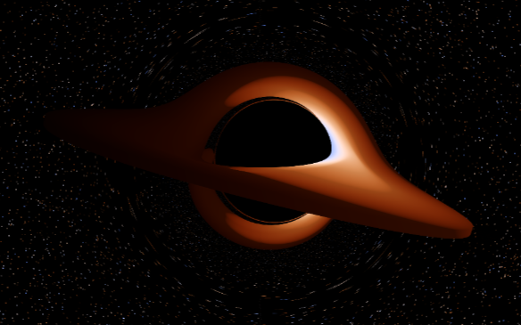

---

* [Introduction](#introduction)
* [Features and limitations](#features)
* [Examples](#examples)
* [Getting started](#getting-started)
* [Report a bug](#bugs)
* [Development information](#dev)
* [Acknowledgements](#acknowledgements)

# Introduction
 is an embedded language for writing GPU shaders in Haskell, compiling to *SPIR-V* for use in *Vulkan* or *OpenCL* applications.

FIR is intended as an alternative shading language to *GLSL*, providing amenities of modern functional programming such as a strong type-system, user-managed control-flow with monads and *do* notation, applicative/foldable/traversable functors, etc.
The Haskell type system helps in verifying programs at compile-time, with the use of *indexed monads* to keep track of program state. Invalid behaviour is reported with custom type errors, preventing run-time errors and lost hours spent debugging a black screen.

# Features and limitations

FIR provides an EDSL for writing shaders. A shader module is specified in two parts:

  * The shader interface, provided at the type-level.
    This consists of inputs/outputs and uniforms, together with relevant annotations such as the binding number of a uniform, memory location of an input/output, and shader execution modes.
  * The shader code itself, most conveniently written using do-notation with the library's indexed monad.
    The indexing allows the library to keep track of the type-level information, such as the inputs/outputs and built-in variables of the shader, as well as user-defined variables and functions.

Refer to the ["getting started" guide (simple shader example)](getting_started.md#simple-shader) for an illustration of the syntax.    

Here are some of the library's __features__:

  * Support for all native Vulkan execution models (all graphics shaders, as well as compute shaders), and OpenCL compute kernels. See the [examples](#examples) for illustration.
  * Image sampling and load/store, with a convenient functional interface given by specifying image operands. This avoids having many different image sampling functions like in GLSL (e.g. `sampler2DArrayShadow`, `textureProjOffset`, ...).
  * Control flow: if-then-else, switch statements and loops, compiled to [SSA form using ϕ-functions](https://en.wikipedia.org/wiki/Static_single_assignment_form). GPU synchronisation with control and memory barriers.
  * Functor/applicative operations, compiling to efficient code (vectorised operations, loops).
  * Type-level optic combinator framework, including the ability to take side-by-side products of optics (disjointness checked at the type-level, ensuring lawfulness). Usage is similar to the [lens library](http://hackage.haskell.org/package/lens), e.g. `view @getter a s`, `assign @setter a`. Refer to the [section on optics](getting_started.md#optics) in the "getting started" guide.
  * Extensive type-level validation: shader interface matching, decorations and execution modes, validation of image read/write/sample operations (including compatibility checking of operations in conjunction with specified image operands and image formats).
  * Automatic memory layout for vertex, uniform, storage buffers and push constants, to conveniently pass data to the GPU.

Current __limitations__ of the library include:

  * Inconsistent quality of error messages. This is a work in progress: the custom type errors are concise and informative, but regularly GHC also produces large error messages with internal representations leaking out (such as a full print-out of the indexed monadic state, which often fills several screens).
  * Lack of validation involving device limits. This should be addressed in the future.
  * Overly-eager inlining. This is mostly due to the functional nature of the library, and can be mitigated (rather tediously) as explained in the ["getting started" guide](getting_started.md#inlining).
  * Support for writing programs that can run both on the CPU (with Haskell) and on the GPU (with SPIRV) is limited.
  This should be addressed in the near future, with the implementation of an evaluator for the AST.
  * SPIR-V atomic operations are currently unsupported, as a convincing interface to these operations has yet to be found.
  * Meta-programming is difficult. This is due to the type-level information that is carried around, which can hardly cope being made polymorphic.
  It is possible that a GHC type-checking plugin could address this limitation.    
  Instead of attempting meta-programming involving manipulation of indexed monadic states,
  it is preferable to keep the state fully polymorphic (by encapsulating local state),
  and instead pass data as arguments instead of through monadic state.

See also the library's [issue tracker](https://gitlab.com/sheaf/fir/issues) for other missing features and limitations.

# Examples

  
       

Usage examples are included in the **fir-examples** subdirectory.     
Shaders can be hot-reloaded, so feel free to play around with them!    

See the [examples readme](fir-examples/readme.md) for installation instructions and further information.

# Getting started

See [getting started](getting_started.md) for help on getting started with this library, including:
  * installation instructions,
  * a simple vertex shader example,
  * how to compile and debug shaders, using built-in functionality as well as SPIR-V tools,
  * a walkthrough of the type-level optics framework used by this library,
  * how to specify graphics pipelines, which can then be used with the [vulkan](https://github.com/expipiplus1/vulkan) or [vulkan-api](https://github.com/achirkin/vulkan) libraries.

The [haddock documentation](https://sheaf.gitlab.io/fir/) is also worth perusing for specialised in-depth explanations.
If you prefer to browse the haddocks locally, the ["getting started" guide](getting_started.md#docs) includes installation instructions.

# Report a bug

Bugs can be reported on the [issue tracker](https://gitlab.com/sheaf/fir/-/issues).    

If the bug concerns one of the Vulkan example programs, please ensure that maximum debug logging is enabled:
  * run the example in GHCi, or pipe stdout to a log file, to obtain the logging information;
  * ensure the Vulkan SDK is installed (which enables the Vulkan validation layers);
  * set the `VK_LOADER_DEBUG` environment variable to the value `all`, enabling the loader debug messages.

# Development information

An overview of the library, from a developer's perspective, is available [here](dev_info.md).

# Acknowledgements

I extend my thanks to:
* **Baldur Blöndal**, for helping me get started with this project, indulging my silly questions, and pointing me to the paper [*Combining Deep and Shallow Embedding for EDSL*](http://www.cse.chalmers.se/~josefs/publications/TFP12.pdf) by Josef Svenningsson and Emil Axelsson, which provided the foundational design of this library.
* **Callan McGill**, for encouraging me, spending long hours helping to debug the library (and getting it working on Linux), and generally keeping me sane.
* **Li-yao Xia**, for his assistance in improving the typing of the AST, and his always excellent answers on StackOverflow.
* **Sylvain Henry**, for his help and suggestions regarding extensible syntax trees as well as the nicely thought-out [variants](https://hackage.haskell.org/package/haskus-utils-variant) library (among other things).
* **Oliver Charles**, for inspiring me to take on this project by streaming his efforts at [porting Quake 3 to Haskell using Vulkan](https://github.com/ocharles/zero-to-quake-3). This was invaluable in helping me get started with using Vulkan in Haskell.
* **Artem Chirkin** and **Joe Hermaszewski** for their work providing Vulkan bindings for Haskell.
* **Schell Scivally**, for patiently explaining his [ixshader library](https://hackage.haskell.org/package/ixshader).
* **Conor McBride**, whose paper [*Kleisli arrows of outrageous fortune*](https://personal.cis.strath.ac.uk/conor.mcbride/Kleisli.pdf) forms the basis of the implementation of indexed monads which enabled the approach taken in FIR.
* **The GHC developers**, for their tireless work on improving Haskell, tremendously helpful advice, and for continually keeping me excited in the future of programming.
* **Epic Games**, for giving me a huge boost by supporting me through their [MegaGrants program](https://www.unrealengine.com/megagrants).

 
